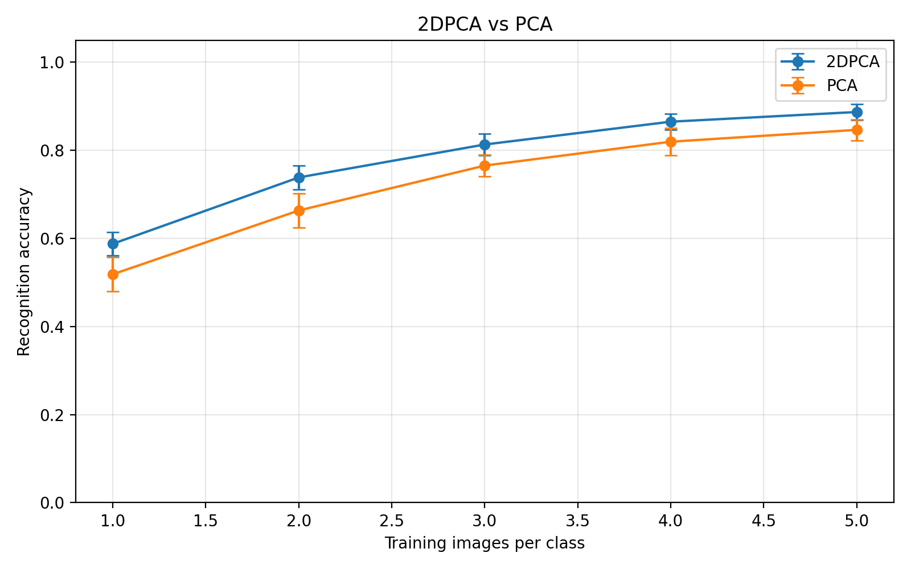
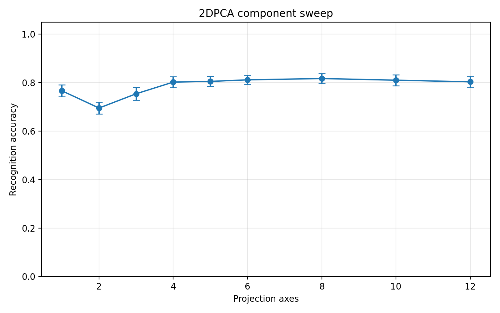
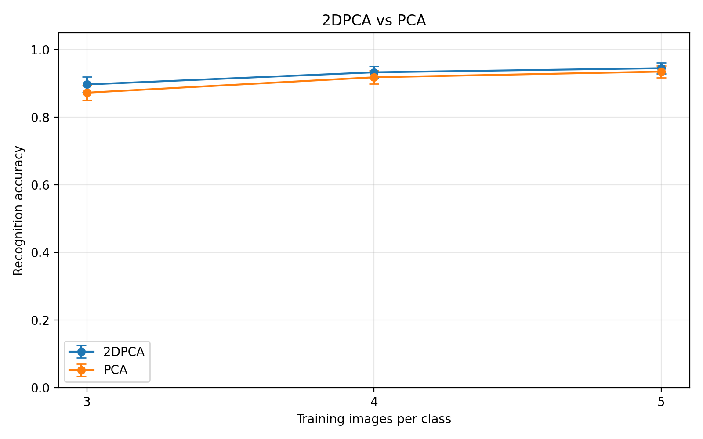
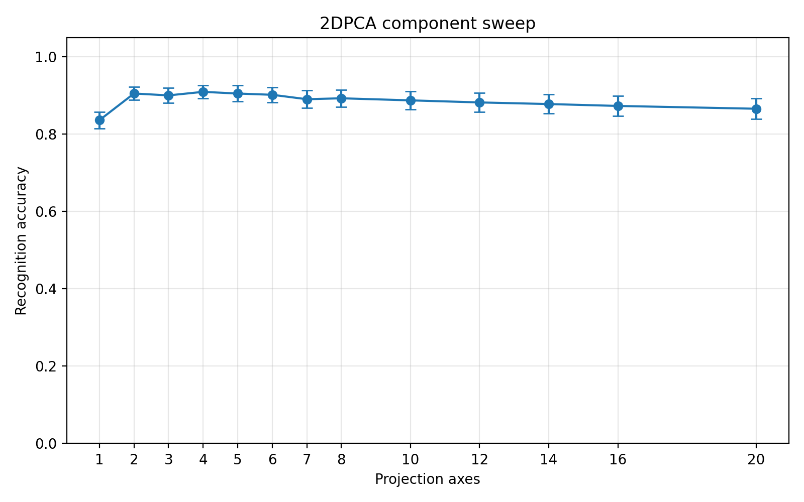
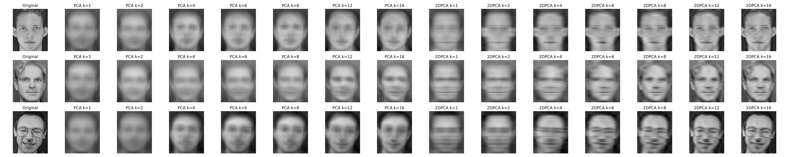
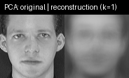
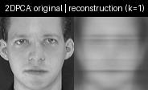

# 2DPCA 实验总文档

## 1. 项目目标

本项目用于复现 2DPCA 论文的核心算法与实验结论，覆盖以下两个重点：

1. 2DPCA 与传统 PCA 在人脸识别任务上的性能对比。
2. 重构演示：随着投影维数 k 增加，人脸图像逐渐清晰。

## 2. 当前实现内容

- 2DPCA 主算法
- PCA 基线算法
- 最近邻分类识别实验
- ORL 风格本地数据集加载
- Olivetti 数据集快速验证
- 结果导出（CSV、PNG、GIF）

核心代码位置：

- [twodpca/algorithms.py](twodpca/algorithms.py)
- [twodpca/datasets.py](twodpca/datasets.py)
- [twodpca/experiments.py](twodpca/experiments.py)
- [scripts/run_reproduction.py](scripts/run_reproduction.py)
- [scripts/run_reconstruction_demo.py](scripts/run_reconstruction_demo.py)

## 3. 环境与安装

```bash
pip install -r requirements.txt
```

## 4. 算法说明

2DPCA 直接在图像矩阵上建模，不先拉平成向量。设训练图像为 $A_1, A_2, \dots, A_M$，平均图像为：

$$
\bar{A} = \frac{1}{M}\sum_{j=1}^{M} A_j
$$

图像散布矩阵为：

$$
G = \frac{1}{M}\sum_{j=1}^{M} (A_j - \bar{A})^T (A_j - \bar{A})
$$

取 $G$ 的前 $d$ 个主特征向量构成投影轴矩阵 $W$，投影特征为：

$$
Y = (A - \bar{A})W
$$

分类采用 1-NN，距离为列向量欧氏距离求和（支持 Frobenius 距离切换）。

## 5. 数据集说明

### 5.1 Olivetti（快速验证）

- 样本数：400
- 类别数：40
- 尺寸：64 x 64

### 5.2 ORL / AT&T Faces（高标准复现）

- 目录：[data/att_faces_raw](data/att_faces_raw)
- 类别数：40
- 每类样本：10
- 总样本：400
- 尺寸：112 x 92

## 6. 运行命令

### 6.1 Olivetti 默认实验

```bash
python scripts/run_reproduction.py --dataset olivetti --output-dir results
```

### 6.2 ORL 高标准复现实验

```bash
python scripts/run_reproduction.py \
  --dataset orl \
  --dataset-path data/att_faces_raw \
  --output-dir results_orl \
  --train-sizes 3,4,5 \
  --repeats 30 \
  --pca-components 40 \
  --twodpca-components 8 \
  --sweep-train-per-class 3 \
  --sweep-components 1,2,3,4,5,6,7,8,10,12,14,16,20 \
  --random-state 42
```

### 6.3 重构清晰度 Demo

```bash
python scripts/run_reconstruction_demo.py \
  --dataset orl \
  --dataset-path data/att_faces_raw \
  --output-dir results_orl \
  --sample-indices 0,99,199 \
  --k-values 1,2,4,6,8,12,16
```

### 6.4 单元测试

```bash
python -m unittest discover -s tests
```

## 7. 实验结果汇总

### 7.1 Olivetti 结果（results）

来源文件：

- [results/train_size_summary.csv](results/train_size_summary.csv)
- [results/component_summary.csv](results/component_summary.csv)

对比结果（每类训练样本从 1 到 5）：

| 每类训练图像数 | 2DPCA 均值 | PCA 均值 |
| --- | ---: | ---: |
| 1 | 0.5878 | 0.5186 |
| 2 | 0.7384 | 0.6634 |
| 3 | 0.8132 | 0.7654 |
| 4 | 0.8650 | 0.8196 |
| 5 | 0.8870 | 0.8465 |

可视化：

- [results/train_size_summary.png](results/train_size_summary.png)
- [results/component_summary.png](results/component_summary.png)

内嵌展示：




### 7.2 ORL 结果（results_orl）

来源文件：

- [results_orl/train_size_summary.csv](results_orl/train_size_summary.csv)
- [results_orl/component_summary.csv](results_orl/component_summary.csv)

PCA 与 2DPCA 对比（30 次重复）：

| 每类训练图像数 | 2DPCA 均值 | PCA 均值 |
| --- | ---: | ---: |
| 3 | 0.8971 | 0.8729 |
| 4 | 0.9331 | 0.9183 |
| 5 | 0.9452 | 0.9352 |

2DPCA 维数扫描（训练 3 张/类）最佳结果：

- 最佳 k：4
- 最佳均值识别率：0.9094

可视化：

- [results_orl/train_size_summary.png](results_orl/train_size_summary.png)
- [results_orl/component_summary.png](results_orl/component_summary.png)

内嵌展示：




## 8. 重构 Demo 结果

已生成以下文件用于展示 k 增长带来的重构清晰度提升：

- [results_orl/reconstruction_progression.png](results_orl/reconstruction_progression.png)
- [results_orl/reconstruction_pca.gif](results_orl/reconstruction_pca.gif)
- [results_orl/reconstruction_2dpca.gif](results_orl/reconstruction_2dpca.gif)

内嵌展示：





观察结论：

- 当 k 从低到高增加时，轮廓、五官与纹理细节持续恢复。
- 在低维阶段，2DPCA 的结构恢复通常更稳定。

## 9. 结果目录说明

### 9.1 results

- train_size_runs.csv
- train_size_summary.csv
- train_size_summary.png
- component_runs.csv
- component_summary.csv
- component_summary.png
- run_config.json

### 9.2 results_orl

- train_size_runs.csv
- train_size_summary.csv
- train_size_summary.png
- component_runs.csv
- component_summary.csv
- component_summary.png
- reconstruction_progression.png
- reconstruction_pca.gif
- reconstruction_2dpca.gif
- run_config.json

## 10. 说明

- 不同随机划分、图像预处理和参数设置会带来数值波动。
- 当前 ORL 结果已复现论文主趋势：2DPCA 在识别率上整体优于 PCA，且存在较优 k 区间。
