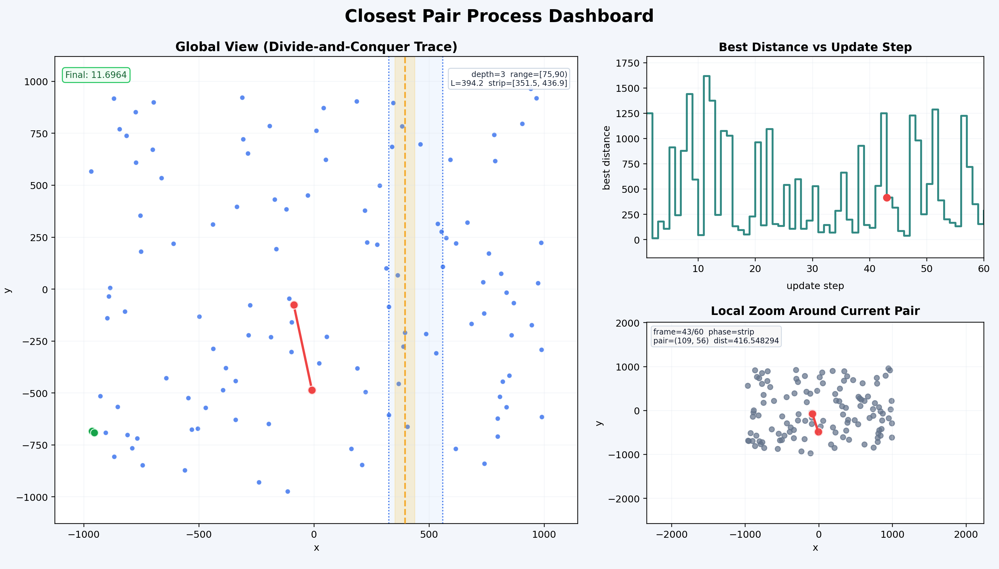
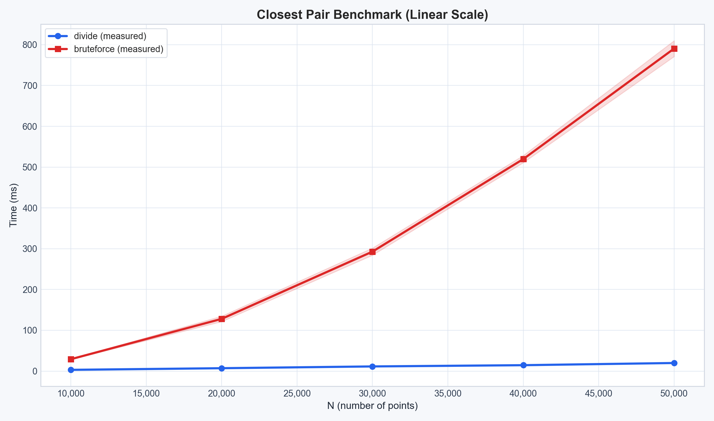
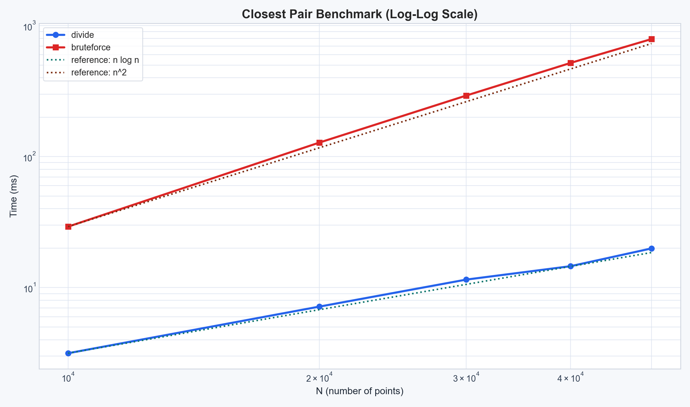

# 实验2：分治法求最近点对问题实验报告

## 1. 实验目的
- 掌握平面最近点对问题的定义与求解方法。
- 实现并比较蛮力法与分治法，分析理论复杂度与实测效率。
- 基于随机数据完成多组规模测试，并比较两种算法在不同输入规模下的运行效率。
- 使用图形界面展示算法执行过程与最终结果。

## 2. 实验环境
- 操作系统：Windows
- 实现语言：C++17（核心算法）+ Python 3（可视化与报告辅助）
- 编译参数：`-O2 -std=c++17`
- 实验时间：2026-04-16 20:51:44

## 3. 问题描述
给定平面上 `N` 个点，求所有点对中欧氏距离最小的一对点。设两点 `p_i=(x_i,y_i)`、`p_j=(x_j,y_j)`，则距离为：

$$
d(p_i,p_j)=\sqrt{(x_i-x_j)^2+(y_i-y_j)^2}
$$

当点数较大时，直接枚举所有点对需要比较 $\frac{n(n-1)}{2}$ 次，代价较高，因此需要引入更高效的分治算法。

## 4. 算法设计
### 4.1 蛮力法
- 枚举所有点对，共 $\frac{n(n-1)}{2}$ 个距离。
- 维护当前最小值及对应点对。
- 时间复杂度为 $O(n^2)$，空间复杂度为 $O(1)$（不计输入存储）。

### 4.2 分治法
- 将点按 `x` 坐标排序，从中点分割为左右两部分。
- 递归求解左右子问题最近距离 $d_L, d_R$，取 $d=\min(d_L,d_R)$。
- 只在中线两侧宽度为 `2d` 的带状区域内按 `y` 坐标进行有限比较。
- 时间复杂度为 $O(n\log n)$，空间复杂度约为 $O(n)$（索引与递归辅助）。

### 4.3 按算法思想提示的逐条说明
1. 预处理：
   - 对同一批点分别按 `x`、`y` 坐标排序，得到序列 `X` 与 `Y`。
   - 该步骤复杂度为 $O(n\log n)$，是一次性全局排序成本。

2. 递归基：
   - 当点数满足 $|S|\le 3$ 时，直接用蛮力法枚举所有点对即可。
   - 该做法简单且能保证递归正确终止。

3. 均匀划分：
   - 在 `X` 中取中位位置 $m=\lfloor n/2\rfloor$，以 `x=x_m` 作为分割直线。
   - 左右子集规模大致均衡，递归深度约为 $\log n$。

4. 合并思想：
   - 递归得到左半最近距离 $d_L$ 与右半最近距离 $d_R$。
   - 令 $d=\min(d_L,d_R)$，则任何可能优于当前答案的跨边界点对一定落在宽度 `2d` 的中间带中。

5. 带状区域筛选：
   - 构造满足 $|x-x_m|<d$ 的点集，并按 `y` 坐标升序排列。
   - 借助 `y` 方向有序性，可以在比较时快速剪枝。

6. 常数次比较结论：
   - 对带状区域中每个点，只需检查其后续 `y` 差小于 `d` 的常数个点。
   - 平面情形下该常数上界为 7，因此单层合并复杂度为 $O(n)$。

于是递推式为

$$
T(n)=2T(n/2)+O(n)
$$

由主定理得

$$
T(n)=O(n\log n)
$$

## 5. 关键实现说明
- C++ 程序支持三种模式：
  - `validate`：小规模正确性校验（蛮力法 vs 分治法）
  - `export`：导出演示点集与最近点对 CSV
  - `benchmark`：批量性能测试并输出 CSV
- Python 脚本：
  - `visualize_process.py`：Matplotlib 展示分治过程、当前候选点对、局部放大视图与更新轨迹
  - `plot_benchmark.py`：根据 `benchmark.csv` 生成线性坐标与 log-log 坐标性能图

## 6. 实验内容与步骤
### 6.1 实验内容
- 实现最近点对问题的两种求解方法：蛮力法与分治法，并对两者结果进行一致性校验。
- 构造小规模测试数据验证算法正确性，覆盖点数较少和边界输入场景。
- 生成大规模随机点集，统计两种算法在不同数据规模下的运行时间。
- 基于实验输出生成性能对比图与过程可视化图，用于分析算法效率差异和理解分治过程。

### 6.2 实验步骤
#### 步骤1：测试数据准备
1. 手动构造小规模点集，并结合程序的 `validate` 模式验证输出结果。
2. 使用固定随机种子生成随机点集，保证实验可复现。
3. 对性能测试选取 `10000`、`20000`、`30000`、`40000`、`50000` 五组规模。

#### 步骤2：实现蛮力法算法
1. 使用双层循环遍历所有点对并计算欧氏距离。
2. 在遍历过程中维护当前最小距离及对应点对。
3. 在小规模数据上首先验证距离计算与最近点对输出是否正确。

#### 步骤3：实现分治法算法
1. 对点集分别按 `x`、`y` 坐标排序，作为递归划分与带状筛选的基础。
2. 编写递归函数，对左右子区间分别求解最近点对，并处理点数不超过 3 的递归基情形。
3. 在合并阶段构造中间带状区域，按 `y` 坐标扫描，只比较有限个候选点。
4. 调试递归划分、边界处理和带状区域比较逻辑，确保分治法结果与蛮力法一致。

#### 步骤4：算法测试与验证
1. 使用 `validate` 模式对蛮力法和分治法进行正确性对比。
2. 使用 `export` 模式导出演示点集、最近点对和递归跟踪数据，为可视化提供输入。
3. 使用 `benchmark` 模式对不同规模点集进行性能测试，并对每组数据重复运行 5 次。

#### 步骤5：实验结果整理与分析
1. 汇总 `benchmark.csv` 中的时间数据，计算均值与标准差。
2. 根据实验数据绘制线性坐标性能图和 log-log 性能图。
3. 结合过程可视化图分析分治法的划分、带状区域筛选与最近点对更新过程。

## 7. 实验结果
### 7.1 正确性与过程可视化
小规模演示数据导出了点集、递归分治边界、带状区域以及当前最优点对更新过程。该图适合放在“实验结果”开头，而不是放在性能表后面，因为它主要回答“算法是如何工作的”，不是“算法有多快”。

从图中可以观察到：
1. 左侧主图展示了全局点集、分治中线以及带状区域。
2. 右上角曲线展示了随着更新步推进，当前最优距离不断下降。
3. 右下角局部放大图便于观察当前候选点对的空间位置关系。
4. 最终绿色标记给出了最近点对的最终结果，其距离约为 `11.6964`。

图1 最近点对分治过程可视化。建议放在“7.1 正确性与过程可视化”小节，紧接在文字解释之后。

### 7.2 性能测试数据表
性能测试对五组规模分别重复运行 5 次，统计均值和标准差，结果如下表所示。

| N | 算法 | 均值时间(ms) | 标准差(ms) | 重复次数 | 数据类型 |
|---:|---|---:|---:|---:|---|
| 10000 | bruteforce | 29.216 | 0.736 | 5 | 实测 |
| 10000 | divide | 3.153 | 0.248 | 5 | 实测 |
| 20000 | bruteforce | 128.086 | 6.653 | 5 | 实测 |
| 20000 | divide | 7.156 | 0.751 | 5 | 实测 |
| 30000 | bruteforce | 292.893 | 8.816 | 5 | 实测 |
| 30000 | divide | 11.510 | 1.171 | 5 | 实测 |
| 40000 | bruteforce | 519.692 | 8.802 | 5 | 实测 |
| 40000 | divide | 14.568 | 1.350 | 5 | 实测 |
| 50000 | bruteforce | 790.490 | 19.439 | 5 | 实测 |
| 50000 | divide | 19.910 | 0.469 | 5 | 实测 |

从表中可见，分治法在全部规模下都优于蛮力法，并且随着 `N` 增大，二者差距持续扩大。在 `10000` 个点时，分治法约快 `9.27` 倍；在 `50000` 个点时，分治法约快 `39.70` 倍。

### 7.3 线性坐标性能对比图
线性坐标图最适合放在性能数据表后面。因为读者先看表能知道原始数值，再看图就能更直观地感受到两条曲线的分离趋势。

该图主要反映两点：
1. 蛮力法曲线增长很快，呈明显上凸趋势。
2. 分治法曲线增长较缓，在同一坐标轴下几乎贴近底部，说明常数项和增长率都明显更小。

图2 最近点对算法性能对比图（线性坐标）。建议放在“7.3 线性坐标性能对比图”小节，用于直接展示两种算法的绝对运行时间差异。

### 7.4 Log-Log 坐标复杂度验证图
log-log 图不适合放在最前面，它更适合放在线性图之后，因为它的作用不是展示“差多少”，而是辅助判断“增长阶是否匹配理论复杂度”。

图中加入了两条参考线：
1. 分治法对应的 `n log n` 参考线。
2. 蛮力法对应的 `n^2` 参考线。

从图中可以看出，实测曲线与理论参考线整体趋势较为接近，说明实验结果与复杂度分析一致。

图3 最近点对算法性能对比图（log-log 坐标）。建议放在复杂度分析前，作为理论与实测对比的过渡图。

## 8. 理论与实测对比分析
1. 蛮力法运行时间从 `29.216ms` 增长到 `790.490ms`，增长幅度显著，符合 $O(n^2)$ 的理论特征。
2. 分治法运行时间从 `3.153ms` 增长到 `19.910ms`，增长速度明显更缓，和 $O(n\log n)$ 的趋势一致。
3. log-log 图中，分治法实测曲线与 `n log n` 参考线较接近，蛮力法实测曲线与 `n^2` 参考线较接近，说明理论分析与实验数据吻合较好。
4. 每组数据重复测量 5 次后再统计均值与标准差，避免了单次实验偶然波动对结论的影响。
5. 实测结果仍会受到常数项、编译优化、缓存局部性、随机点分布和系统调度噪声的影响，因此不会与理论曲线完全重合。

## 9. 结论
- 在本实验给出的 `10000` 到 `50000` 个点的规模范围内，分治法始终明显优于蛮力法。
- 随着问题规模增大，分治法相对蛮力法的优势持续扩大，说明其更适合处理中大规模点集。
- 过程可视化图有助于解释分治中线、带状区域与最优点对更新过程；性能图则从实测角度验证了复杂度结论。
- 因此，对于最近点对问题，工程实现中应优先选择分治法而非蛮力法。

## 10. 相关论文与文献综述
1. Shamos, M. I., Hoey, D. (1975). Closest-point problems. Proceedings of 16th Annual IEEE Symposium on Foundations of Computer Science (FOCS), 151-162. DOI: 10.1109/SFCS.1975.8
   - 贡献：给出经典的最近点对分治算法框架，是 $O(n\log n)$ 解法的早期权威来源。

2. Preparata, F. P., Shamos, M. I. (1985). Computational Geometry: An Introduction. Springer.
   - 贡献：系统化阐述计算几何中最近点对问题，并讨论代数决策树模型下该问题的复杂度下界思想。

3. Cormen, T. H., Leiserson, C. E., Rivest, R. L., Stein, C. Introduction to Algorithms, Chapter 33.4 (Finding the closest pair of points).
   - 贡献：教材级证明带状区常数比较结论，工程实现指导性强。

4. Rabin, M. O. (1976). Probabilistic algorithms. In Algorithms and Complexity: Recent Results and New Directions.
   - 贡献：提出最近点对随机化思路的早期来源之一，为期望线性时间算法奠定基础。

5. Khuller, S., Matias, Y. (1995). A simple randomized sieve algorithm for the closest-pair problem. Information and Computation, 118(1), 34-37. DOI: 10.1006/inco.1995.1049
   - 贡献：给出更易分析的随机筛法，达到期望线性时间。

6. Fortune, S., Hopcroft, J. (1979). A note on Rabin's nearest-neighbor algorithm. Information Processing Letters, 8(1), 20-23. DOI: 10.1016/0020-0190(79)90085-1
   - 贡献：对 Rabin 随机化最近邻/最近点对相关算法进行补充分析与改进讨论。

说明：本实验代码采用的是确定性分治主线（$O(n\log n)$），未实现随机化线性期望时间版本；上述 4-6 号文献用于扩展阅读与报告中对更快理论上界的讨论。

## 11. 可复现实验步骤
1. 进入 `code` 目录并运行 `run_experiment.ps1`。
2. 查看 `results/benchmark.csv`、`results/process_dashboard.png`、`results/benchmark_linear.png` 与 `results/benchmark_loglog.png`。
3. 打开本报告，根据课程模板转入 Word 文档。

# 附录A 分治法合并步骤线性效率几何证明（最多6点比较）
## A.1 证明目的
本证明用于解释**平面最近点对分治法合并步骤**的线性时间原理：在宽度为2d的垂直边界带内，按y坐标排序后，每个点仅需与**后续最多6个点**计算距离，即可找到所有可能的跨线最近点对，保证合并步骤为**O(n)** 时间复杂度，是分治法整体达到**O(nlogn)** 的核心依据。

## A.2 前提假设
1. 设递归求解得到左、右点集$S_L$、$S_R$的内部最小距离为$d$，即：
   - $S_L$中任意两点距离$\ge d$
   - $S_R$中任意两点距离$\ge d$
2. 仅在**分界线$L$左右各扩展$d$**的$2d$宽度垂直带内，可能存在跨分界线且距离小于$d$的点对；
3. 垂直带内的点按$y$坐标升序排列为序列$Y'$。

## A.3 核心几何证明
1. **候选区域划定**
对垂直带内任意一点$p$，仅需考察其右侧**$2d \times d$**的矩形区域（跨分界线候选区），该区域外的点与$p$的距离必然大于$d$，无需计算。

2. **区域等分切割**
将$2d(\text{宽}) \times d(\text{高})$的矩形均匀划分为**6个全等小矩形**：
- 横向（$x$方向）2等分，单段宽度：$\boldsymbol{\frac{d}{2}}$
- 纵向（$y$方向）3等分，单段高度：$\boldsymbol{\frac{d}{3}}$
- 单个小矩形尺寸：$\boldsymbol{\frac{d}{2} \times \frac{d}{3}}$

3. **小矩形对角线计算**
单个小矩形的对角线长度$L$为：
$$
L=\sqrt{\left(\frac{d}{2}\right)^2+\left(\frac{d}{3}\right)^2}=\sqrt{\frac{9d^2+4d^2}{36}}=\frac{d\sqrt{13}}{6}\approx0.6009d < d
$$

4. **鸽巢原理反证**
假设$2d \times d$矩形内存在**≥7个点**，根据鸽巢原理，**至少有1个小矩形内含≥2个点**。
这两个点的距离≤小矩形对角线长度$<d$，与**$S_L$、$S_R$内部任意两点距离≥$d$**的前提矛盾。
因此，该$2d \times d$矩形内**最多只能容纳6个满足约束的点**。

## A.4 证明结论
垂直带内按$y$排序后的每个点，仅需与**后续最多6个点**计算距离，即可覆盖所有可能形成更短距离的跨线点对。
总比较次数为$n$的常数倍，合并步骤为**O(n)线性时间**。

## A.5 原始文献依据
该结论与证明出自计算几何经典原始论文：
**Michael I. Shamos, Dan Hoey. Closest-Point Problems. Proceedings of the 16th Annual Symposium on Foundations of Computer Science (FOCS 1975), pp.151-162.**
原文明确表述：*In the strip of width 2δ around the dividing line, each point need be compared with at most six others.*
