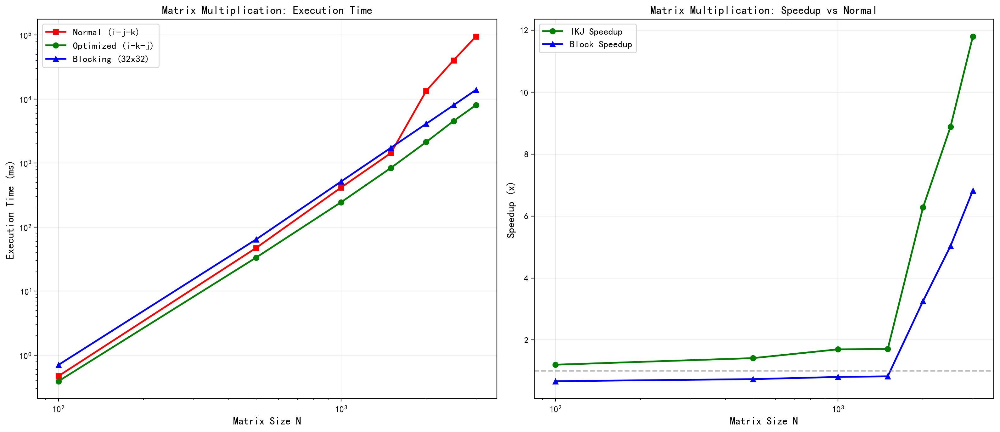
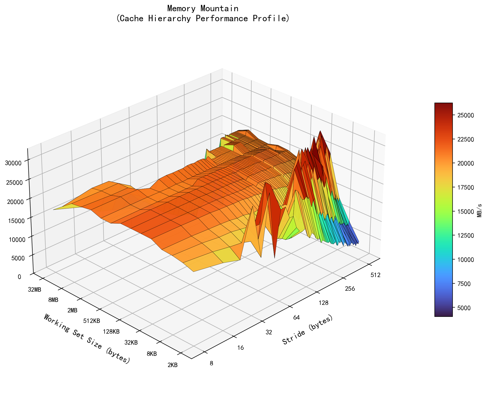
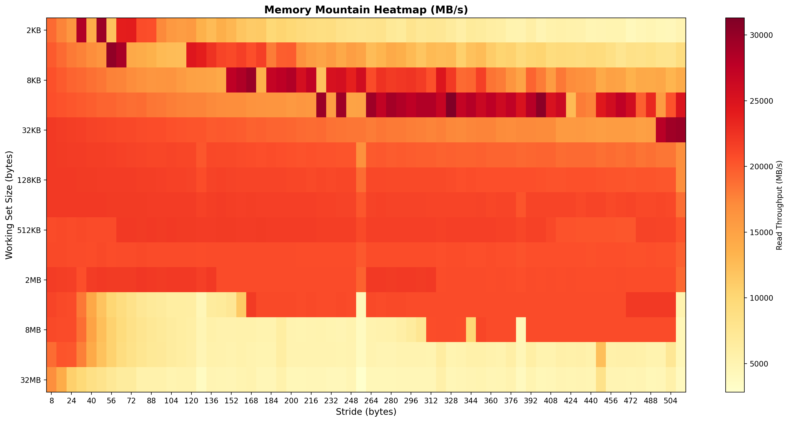
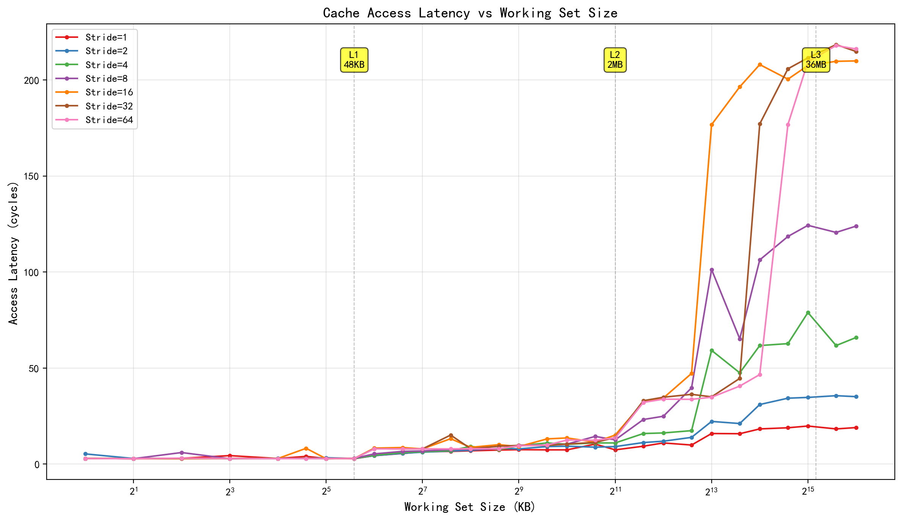
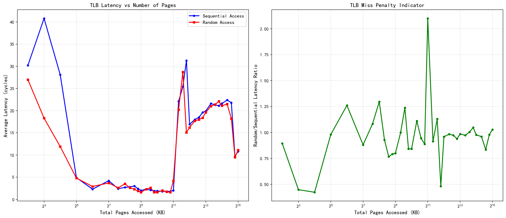

# Cache访存模式与存储器层次结构实验报告

## 一、Cache访存模式对矩阵乘法性能的影响

### 1.1 实验环境

| 项目 | 配置 |
|---|---|
| CPU | Intel(R) Core(TM) i9-14900HX |
| 操作系统 | Windows 原生环境 |
| 编译器 | MinGW GCC 13.2.0 |
| 编译选项 | `gcc -O2` |
| CPU频率 | 实测约 2.41-2.43 GHz |

本次实验之前在 WSL/Linux 环境下测量过。为避免虚拟化环境对 Cache、TLB 和计时结果造成影响，本次重新在 Windows 原生环境下编译并运行，生成的数据文件统一使用 `_win` 后缀。

### 1.2 普通矩阵乘法代码A

普通版本采用 `i-j-k` 三重循环：

```c
for (i = 0; i < size; i++) {
    for (j = 0; j < size; j++) {
        c[i * size + j] = 0;
        for (k = 0; k < size; k++)
            c[i * size + j] += a[i * size + k] * b[k * size + j];
    }
}
```

C语言二维数组按行连续存储。普通算法内层循环中，`a[i*size+k]` 是连续访问，但 `b[k*size+j]` 是按列访问，每次 `k` 增加都会跨过 `size` 个 `float`。矩阵较大时，这种大步长访问很难充分利用 cache line，空间局部性较差。

### 1.3 优化代码

本实验比较了 `i-k-j` 循环顺序和 `32x32` 分块两种优化。`i-k-j` 的核心是把对 B、C 的访问改为内层连续访问：

```c
for (i = 0; i < size; i++)
    for (k = 0; k < size; k++) {
        float temp = a[i * size + k];
        for (j = 0; j < size; j++)
            c[i * size + j] += temp * b[k * size + j];
    }
```

分块版本位于 `matrix_block.c`，核心思想是把矩阵划分为 `32x32` 的小块，并在块内采用 `i-k-j` 顺序：

```c
#define BLOCK_SIZE 32

for (i = 0; i < size; i += BLOCK_SIZE)
    for (k = 0; k < size; k += BLOCK_SIZE)
        for (j = 0; j < size; j += BLOCK_SIZE)
            for (i1 = i; i1 < i + BLOCK_SIZE && i1 < size; i1++)
                for (k1 = k; k1 < k + BLOCK_SIZE && k1 < size; k1++) {
                    float temp_a = a[i1 * size + k1];
                    for (j1 = j; j1 < j + BLOCK_SIZE && j1 < size; j1++)
                        c[i1 * size + j1] += temp_a * b[k1 * size + j1];
                }
```

优化后，内层循环连续访问 `b[k1*size+j1]` 和 `c[i1*size+j1]`，CPU可以更好地利用空间局部性和硬件预取。分块还增强了时间局部性，使一小块数据在 cache 中被多次复用。

### 1.4 测试结果

单位：ms。加速比 `speedup = 普通算法执行时间 / 优化算法执行时间`。

| 矩阵大小 | 100 | 500 | 1000 | 1500 | 2000 | 2500 | 3000 |
|---|---:|---:|---:|---:|---:|---:|---:|
| 普通 i-j-k | 0.471 | 47.153 | 415.363 | 1433.366 | 13378.561 | 40334.591 | 94945.682 |
| i-k-j | 0.392 | 33.353 | 244.792 | 840.012 | 2129.580 | 4543.531 | 8047.642 |
| 32x32 分块 | 0.704 | 64.105 | 515.215 | 1734.882 | 4108.947 | 8019.011 | 13915.091 |
| i-k-j 加速比 | 1.20 | 1.41 | 1.70 | 1.71 | 6.28 | 8.88 | 11.80 |
| 分块加速比 | 0.67 | 0.74 | 0.81 | 0.83 | 3.26 | 5.03 | 6.82 |



### 1.5 结果分析

当 `N=100~1500` 时，`i-k-j` 版本已经明显优于普通 `i-j-k`，原因是它把 B 矩阵的访问从按列跳跃改为按行连续访问。分块版本在小规模矩阵上反而慢一些，主要是多层循环边界判断和块调度开销抵消了局部性收益。

当 `N=2000~3000` 时，单个矩阵大小分别约为 16MB、25MB、36MB，三个矩阵的总工作集远超 L1/L2 Cache。普通算法对 B 的大步长访问会造成大量 cache miss；`i-k-j` 和分块算法提高了 cache line 利用率。`N=3000` 时，`i-k-j` 加速比约为 `11.80x`，分块算法加速比约为 `6.82x`。

---

## 二、测量分析出Cache 的层次结构、容量以及L1 Cache行有多少？

### 2.1实验原理

Cache 利用程序访问的局部性来隐藏主存访问延迟。若工作集能放入某一级 Cache，则多数访问命中该级 Cache，平均访问延迟较低；当工作集逐渐超过 L1、L2、L3 容量后，访问需要到更低层次获取数据，平均延迟会出现阶跃式上升。

本实验用两种方式观察 Cache 层次：

1. 存储器山：改变 working set size 和 stride，测量读吞吐率。小工作集、小步长通常吞吐率最高；工作集增大或步长增大后，吞吐率下降。
2. Pointer chasing 延迟测量：构造依赖链式访问，每次加载结果决定下一次访问位置，从而削弱乱序执行、流水线并行和简单硬件预取对测量的影响。

Cache line 大小可以通过 stride 变化推断。本实验数据元素为 `double`，每个元素 `8B`。当 stride 从 1、2、4 增加到 8 时，访问间隔达到 `8 * 8B = 64B`。若此时吞吐率或延迟出现明显变化，说明一次访问基本跨到新的 cache line，因此可推断 L1 Cache 行大小约为 `64B`。

### 2.2测量方案及代码

使用 `mountain.c` 生成 memory mountain，遍历工作集大小和访问步长：

```c
for (size = MAXBYTES; size >= MINBYTES; size >>= 1) {
    for (stride = 1; stride <= MAXSTRIDE; stride++) {
        printf("%.1f\t", run(size, stride, Mhz));
    }
}
```

其中 `MINBYTES = 2KB`，`MAXBYTES = 32MB`，`MAXSTRIDE = 64`，每次调用 `run(size, stride, Mhz)` 测量读吞吐率：

```c
void test(int elems, int stride)
{
    int i;
    double result = 0.0;
    volatile double sink;

    for (i = 0; i < elems; i += stride)
        result += data[i];

    sink = result;
}
```

使用 `cache_latency.c` 进一步测量平均访问延迟。该程序在数组中构造一个循环链表：

```c
for (int i = 0; i < count; i++)
    indices[i] = i * stride_elems;

for (int i = count - 1; i > 0; i--) {
    int j = rand() % (i + 1);
    int tmp = indices[i];
    indices[i] = indices[j];
    indices[j] = tmp;
}

for (int i = 0; i < count; i++)
    next[indices[i]] = indices[(i + 1) % count];
```

测量时使用 `rdtsc/rdtscp` 读取 CPU 周期数：

```c
uint64_t start = rdtsc_start();
for (int i = 0; i < STEPS_PER_TEST; i++)
    idx = next[idx];
uint64_t end = rdtsc_stop();

latency = (double)(end - start) / STEPS_PER_TEST;
```

本次 Windows 原生运行命令如下：

```powershell
gcc -O2 -o mountain_win.exe mountain.c fcyc2.c clock.c
gcc -O2 -o cache_latency_win.exe cache_latency.c -lm

./mountain_win.exe > mountain_data_win.txt
./cache_latency_win.exe > $null 2> cache_latency_data_win.txt
```

### 2.3 测试结果

`mountain_win.exe` 测得 CPU 频率约为 `2432.5 MHz`，`cache_latency_win.exe` 测得 CPU 频率约为 `2419.1 MHz`。





Cache 延迟数据节选如下，单位为 cycles/access：

| 工作集(KB) | Stride1 | Stride2 | Stride4 | Stride8 | Stride16 | Stride32 | Stride64 |
|---:|---:|---:|---:|---:|---:|---:|---:|
| 16.0 | 2.9 | 3.0 | 2.8 | 2.9 | 2.9 | 2.9 | 2.8 |
| 32.0 | 2.9 | 3.3 | 2.8 | 2.8 | 2.8 | 2.9 | 2.9 |
| 48.0 | 2.8 | 2.9 | 2.9 | 3.0 | 2.9 | 2.9 | 2.9 |
| 64.0 | 4.4 | 4.4 | 4.6 | 5.3 | 8.3 | 8.0 | 7.9 |
| 128.0 | 6.4 | 6.2 | 6.4 | 6.8 | 7.9 | 7.9 | 7.9 |
| 512.0 | 7.5 | 7.9 | 9.5 | 9.8 | 9.1 | 9.7 | 9.5 |
| 1024.0 | 7.4 | 9.3 | 10.3 | 10.4 | 13.6 | 10.4 | 12.5 |
| 2048.0 | 7.4 | 9.1 | 11.0 | 12.6 | 15.1 | 13.8 | 13.6 |
| 4096.0 | 11.0 | 11.9 | 16.2 | 24.9 | 34.4 | 34.8 | 33.8 |
| 8192.0 | 15.9 | 22.2 | 59.2 | 101.3 | 176.7 | 35.0 | 34.8 |
| 16384.0 | 18.3 | 31.0 | 61.7 | 106.3 | 208.0 | 177.1 | 46.6 |
| 32768.0 | 19.8 | 34.7 | 78.9 | 124.3 | 207.5 | 211.5 | 209.5 |
| 65536.0 | 19.0 | 35.1 | 65.9 | 123.9 | 209.9 | 214.8 | 216.1 |



### 2.4分析过程

从延迟数据看，工作集在 `48KB` 以内时，各 stride 的访问延迟基本保持在 `2.8~3.3 cycles/access`，说明数据主要命中 L1 Data Cache。当工作集增加到 `64KB` 后，延迟上升到约 `4.4~8.3 cycles/access`，说明工作集已经超过 L1D 容量。因此可判断 L1 Data Cache 容量约为 `48KB/核`。

当工作集在 `128KB~2048KB` 范围内时，延迟大致处于 L2 Cache 访问范围。到 `3072KB/4096KB` 后，部分 stride 的延迟明显升高，例如 `4096KB` 时 stride16、stride32 达到约 `34 cycles/access`，说明已经开始超过单核 L2 可有效容纳的范围。结合 Windows `Win32_Processor` 查询到的 `L2CacheSize = 32768KB`，该处理器共有约 `32MB` L2；i9-14900HX 为 24 核，其中 P-core/E-core 组织会导致每核或每簇看到的 L2 容量不同。按实验曲线和处理器结构综合判断，P-core L2 约为 `2MB`，全芯片 L2 总量约为 `32MB`。

当工作集继续增加到 `32768KB` 和 `65536KB` 时，多个 stride 的延迟达到 `200 cycles/access` 左右，说明数据已经接近或超过最后一级 Cache，并开始大量访问主存。Windows 查询到 `L3CacheSize = 36864KB`，即约 `36MB` 共享 L3，与曲线在 `32MB~64MB` 区间出现高延迟的现象一致。

对 L1 Cache 行大小的判断：本实验中一个 `double` 为 `8B`，stride8 对应 `64B`。当 stride 增大到 8 或更大时，每次访问更容易落到新的 cache line，cache line 中剩余数据无法被利用，吞吐率下降、延迟上升。因此 L1 Cache line 大小判断为 `64B`。

最终测量和分析结果如下：

| Cache级别 | 容量判断 | 依据 |
|---|---:|---|
| L1 Data Cache | 约 48KB/核 | 48KB 以内延迟约 3 cycles，64KB 开始上升 |
| L2 Cache | 约 2MB/核，约 32MB 总量 | 2MB 后延迟逐渐升高；Windows 查询 L2 总量为 32768KB |
| L3 Cache | 约 36MB 共享 | Windows 查询 L3 为 36864KB；32MB 到 64MB 区间延迟明显升高 |
| L1 Cache line | 64B | `double` stride8 对应 64B，步长增大后空间局部性明显下降 |

若 L1D 容量为 `48KB`、cache line 为 `64B`，则 L1D cache line 数量约为：

```text
48KB / 64B = 49152B / 64B = 768 行
```

### 2.5 验证实验结果

为了验证上述判断，本实验采用三类证据交叉确认：

1. 延迟曲线验证：`cache_latency_data_win.txt` 中，工作集从 `48KB` 增加到 `64KB` 时延迟出现第一次明显上升，验证 L1D 容量约为 `48KB`。
2. 存储器山验证：`mountain_3d_win.png` 和 `mountain_heatmap_win.png` 中，小工作集、小 stride 区域吞吐率最高；随着工作集增大和 stride 增大，吞吐率下降，符合多级 Cache 逐级失效的规律。
3. 系统信息验证：Windows `Win32_Processor` 查询到 `L2CacheSize = 32768KB`、`L3CacheSize = 36864KB`，与实验中 L2/L3 边界的延迟变化基本一致。

因此，本机 Cache 层次结构可以总结为：L1D 约 `48KB/核`，L2 约 `2MB/核`、全芯片约 `32MB`，L3 约 `36MB` 共享，L1 Cache line 大小为 `64B`，L1D 约 `768` 行。

---

## 三、TLB容量测量（选作）

代码位于 `tlb_measure.c`。实验每次访问一个 4KB 页面中的一个元素，逐渐增加访问页面数，并分别测量顺序访问和随机访问延迟。

| 页面数 | 覆盖大小(KB) | 顺序延迟 | 随机延迟 |
|---:|---:|---:|---:|
| 128 | 512.0 | 2.0 | 1.6 |
| 256 | 1024.0 | 1.9 | 1.6 |
| 512 | 2048.0 | 2.0 | 4.2 |
| 640 | 2560.0 | 22.1 | 20.2 |
| 768 | 3072.0 | 25.4 | 28.7 |
| 1024 | 4096.0 | 16.9 | 16.2 |
| 2048 | 8192.0 | 19.9 | 19.6 |
| 4096 | 16384.0 | 21.6 | 21.1 |
| 8192 | 32768.0 | 10.8 | 11.1 |



从数据看，页面数从 `512` 增加到 `640` 时，顺序和随机访问延迟都明显上升，说明 TLB 已难以完全覆盖当前访问页面集合。后续页面数继续增大时延迟保持在较高水平，说明页表遍历和更高层 TLB 命中情况开始影响访问时间。

---

## 四、复现实验方法

Windows 原生环境下复现实验：

```powershell
gcc -O2 -o matrix_bench_win.exe matrix_bench.c -lm
gcc -O2 -o mountain_win.exe mountain.c fcyc2.c clock.c
gcc -O2 -o cache_latency_win.exe cache_latency.c -lm
gcc -O2 -o tlb_measure_win.exe tlb_measure.c -lm

./matrix_bench_win.exe > matrix_results_win.csv
./mountain_win.exe > mountain_data_win.txt
./cache_latency_win.exe > $null 2> cache_latency_data_win.txt
./tlb_measure_win.exe > tlb_data_win.csv 2> tlb_info_win.txt

python -c "import plot_all as p; p.plot_memory_mountain('mountain_data_win.txt','mountain_3d_win.png'); p.plot_mountain_heatmap('mountain_data_win.txt','mountain_heatmap_win.png'); p.plot_cache_latency('cache_latency_data_win.txt','cache_latency_win.png'); p.plot_matrix_comparison('matrix_results_win.csv','matrix_comparison_win.png'); p.plot_tlb('tlb_data_win.csv','tlb_measurement_win.png')"
```

本次为了在 Windows 下编译原 CSAPP 计时库，对 `clock.c`、`fcyc2.c` 和 `tlb_measure.c` 增加了少量 `_WIN32` 兼容代码，用 `Sleep` 和 Windows 时间函数替代 Linux/Unix 专有接口。

---

## 五、实验总结

1. 矩阵乘法性能受 Cache 访存模式影响明显。普通 `i-j-k` 版本对 B 矩阵按列访问，空间局部性差；`i-k-j` 版本将 B、C 的访问改为连续访问，在大矩阵上获得明显加速。
2. 存储器山展示了空间局部性和时间局部性：小 stride、小 working set 具有最高吞吐率；stride 增大或 working set 超出 Cache 后，吞吐率下降。
3. 本机测得和推断的 Cache 层次为 L1D 约 `48KB/核`、L2 约 `2MB/核` 且全芯片约 `32MB`、L3 约 `36MB` 共享，L1 cache line 大小为 `64B`，L1D 约 `768` 行。
4. TLB 测量显示，当访问页面数从 `512` 增加到 `640` 后，访问延迟明显上升，说明 TLB 容量和页表遍历开销也会影响内存密集型程序性能。
